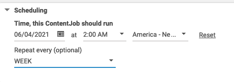
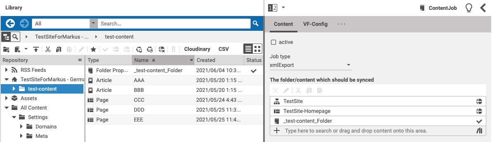
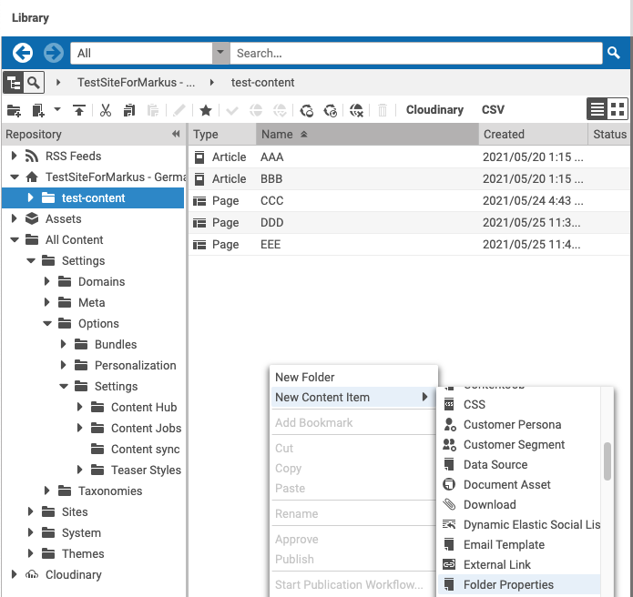
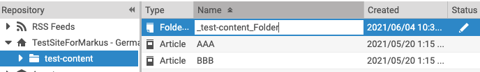
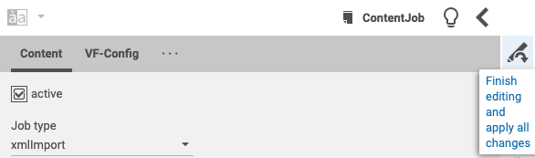
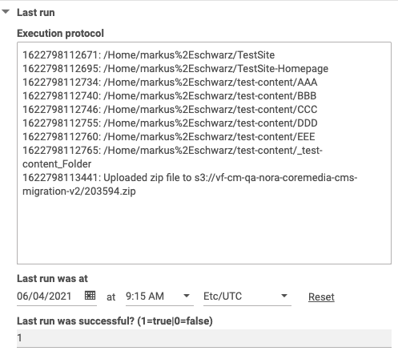
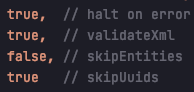
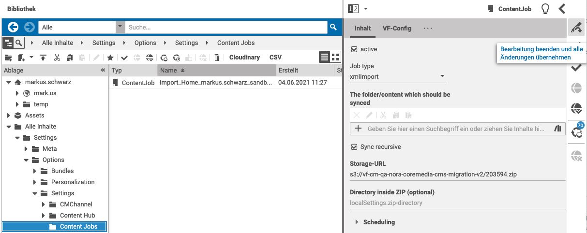

**Core Content Jobs**
=====================

*   [Overview](#Overview)
*   [rssImport](#rssImport)
*   [xmlExport](#id-09.CoreContentJobs-xmlExport)
*   [xmlImport](#id-09.CoreContentJobs-xmlImport)
*   [cleanXmlExportsInS3Bucket](#id-09.CoreContentJobs-cleanXmlExportsInS3Bucket)
*   [bulkPublish](#id-09.CoreContentJobs-bulkPublish)
*   [bulkUnpublish](#id-09.CoreContentJobs-bulkUnpublish)

Overview
--------
[Core Content Jobs](https://github.com/blackappsolutions/core-content-jobs) is a extensible framework provided by [Black App Solutions](https://black-app-solutions.de/). It introduces a new DocType "ContentJob" and uses the [Preview-CAE](https://digital.vfc.com/stash/projects/VEC/repos/coremedia-application/browse/apps/cae/spring-boot/cae-preview-app?at=refs%2Fheads%2Fdevelop) as a runtime environment due to the limitations of CMCC-S. It comes pre-packaged with the following Jobs:


------------------------------------------------------------------------

But you can also develop new jobs very easy:

1.  Create a new class in modules/extensions/blackapp-core-content-jobs/core-content-jobs-cae/src/main/java/de/bas/content/jobs
2.  The class must extend de.bas.content.jobs.AbstractContentJob and should provide the following annotations
    ```
    @Slf4j
    @Scope("prototype")
    @Component("rssImport")
    public class ImportRSSJob extends AbstractContentJob {
    ```
\=> After deplyoment, this class will be usable with the name **rssImport** in **localSettings.job-type** of ContentJob-resources in CMS.  
  

**ContentJobs can be scheduled.**



There is also a [Freemarker-Template](https://github.com/blackappsolutions/core-content-jobs/blob/main/core-content-jobs-cae/src/main/resources/META-INF/resources/WEB-INF/templates/content-jobs/com.coremedia.blueprint.common.contentbeans/CMPlaceholder.%5Bcontent-jobs%5D.ftl) available to maintain long-running/scheduled jobs.

If you want to use the task overview page to cancel scheduled job, create

*   a new Placeholder-ViewType `content-sync-jobs` and
*   a Placeholder-Resource that has this ViewType set.
*   Set the Placeholder-Resource in an Article or Page OR
*   issue `/blueprint/servlet/dynamic/content-jobs/terminate/1234` directly.

* * *

rssImport
---------

Serves only as a blueprint/template for new jobs and wants to show, that you can use this framwork also to do content imports. See source code for details => [https://github.com/blackappsolutions/core-content-jobs/blob/main/core-content-jobs-cae/src/main/java/de/bas/content/jobs/ImportRSSJob.java](https://github.com/blackappsolutions/core-content-jobs/blob/main/core-content-jobs-cae/src/main/java/de/bas/content/jobs/ImportRSSJob.java)

*   Imports RSS from locaSettings.rss-import-url if specified. Otherwise uses "https://rss.nytimes.com/services/xml/rss/nyt/Technology.xml" as default.
*   If you supply another RSS-feed, its structure must match the one in the default-feed above.
*   [Supply a folder](#id-09.CoreContentJobs-defineFolder) in **The folder/content which schould be synced**
*   RSS-Item->title-Attribute is mapped to CMArticle→title
*   RSS-Item->description-Attribute is mapped to CMArticle→detailText
*   For every RSS-Item an Article is created in the folder provided above [after the job was started](#id-09.CoreContentJobs-startJob).
*   Articles were name with this pattern:
    
    RssImport\_" \+ System.currentTimeMillis()

xmlExport
---------

This Job makes use of [CoreMedia's ServerExport Tool](https://documentation.coremedia.com/cmcc-10/artifacts/2010/webhelp/contentserver-en/content/CMServerimportExport.html#d0e17572) by [taking the given content, recursive and the zip-url](https://github.com/blackappsolutions/core-content-jobs/blob/313dda3a416a548facd8605ab988edbe44bf3530/core-content-jobs-cae/src/main/java/de/bas/content/jobs/ExportXMLJob.java#L48). See below how this instrumentation is made in the CMS.

*   In Studio go to "/All Content/Settings/Options/Settings/Content Jobs"
*   Create a new content item of type "ContentJob"
*   set the **Job type** to "xmlExport"
*   Add content you would like to export by using drag&drop to **The folder/content which schould be synced**

****

*   To add a folder, navigate into it and add a new content item of type "Folder Properties"
*   Make the name of this content item reflect the folder name.



  



*   Also drag&drop the new content item of type "Folder Properties" to **The folder/content which schould be synced** (see above)
*   Set the **Storage-URL** to "s3://YOUR_BUCKET_NAME/"
*   **Note**: You can check **Sync Recursive**, if you have provided content item(s) of type "Folder Properties" to **The folder/content which schould be synced** and sync this folder with all of its subfolders.
*   To start the job, you just need to check **active** and push the **Finish editing and apply all changes button**

****

*   When the job is done,
    *   you find a new version of this ContentJob created by user **content-jobs-user**  
        ****
    *   The **active** flag will be unchecked by **content-jobs-user**
    *   If the job was successful, you find a "1" at **Last run / Last run was successful?** otherweise a "0"
    *   When things went fine, you find a protocol at **Last run / Execution protocol** and you can find your content as a zip at s3 (s3://YOUR_BUCKET_NAME/203594.zip).



xmlImport
---------

This Job makes use of [CoreMedia's ServerImport Tool](https://documentation.coremedia.com/cmcc-10/artifacts/2010/webhelp/contentserver-en/content/CMServerimportExport.html#cm:serverimport) by [taking the recursive flag and the zip-url](https://github.com/blackappsolutions/core-content-jobs/blob/313dda3a416a548facd8605ab988edbe44bf3530/core-content-jobs-cae/src/main/java/de/bas/content/jobs/ImportXMLJob.java#L26) and the following defaults:



We can change that behaviour later, when we find out that other defaults may suit better or when we should give users the power to supply that parameters.

So - for example - we could set "halt on error" to false, because of the following scenario:

*   In Import-Zip is a Page with a Link to a Settings-Document located in another folder
*   This Settings-Document was not part of the export
*   Result: Import will do its job until it hits this error. All resources due to this point will be left in state checked-out by user content-jobs-user.

See below how this instrumentation is made in the CMS.

*   Go to "/All Content/Settings/Options/Settings/Content Jobs" at - for example - [https://studio.fourth.sandbox.vfc.coremedia.cloud/](https://studio.fourth.sandbox.vfc.coremedia.cloud/)
*   Create a new ContentJob
*   Set **Job type** to xmlImport
*   Check **Sync recursive**
*   Set **Storage-URL** to s3://vf-cm-qa-nora-coremedia-cms-migration-v2/203594.zip
*   Check **active** and push the **Finish editing and apply all changes button**



cleanXmlExportsInS3Bucket
-------------------------

This job takes care of keeping the s3 bucket clean and can be run (as all other jobs also) scheduled.

To instrument this job, the following properties needs to be set:

*   localSettings.s3-bucket-region (us-east-1)
*   **Storage-URL** (s3://vf-cm-qa-nora-coremedia-cms-migration-v2/content-exports)
*   localSettings.s3-bucket-cleanup-dryrun (true/false)
    

bulkPublish
-----------

Runs the CoreMedia tool [BulkPublish](https://documentation.coremedia.com/cmcc-10/artifacts/2104/webhelp/contentserver-en/content/bulkpublish.html) with the following default properties:

"--checkin"  
"--approve"  
"--publish"  
"--verbose"  

To instrument this job, the following properties needs to be set:  

*   [Define a folder](#id-09.CoreContentJobs-defineFolder)
*   Define "Job type" **bulkPublish**
*   Check **active** and push the **Finish editing and apply all changes button**

bulkUnpublish
-------------

Runs the CoreMedia tool [BulkPublish](https://documentation.coremedia.com/cmcc-10/artifacts/2104/webhelp/contentserver-en/content/bulkpublish.html) with the following default properties:

"--checkin"  
"--approve"  
"--unpublish"  
"--verbose"  

To instrument this job, the following properties needs to be set:

*   [Define a folder](#id-09.CoreContentJobs-defineFolder)
*   Define "Job type" **bulkPublish**
*   Check **active** and push the **Finish editing and apply all changes button**
